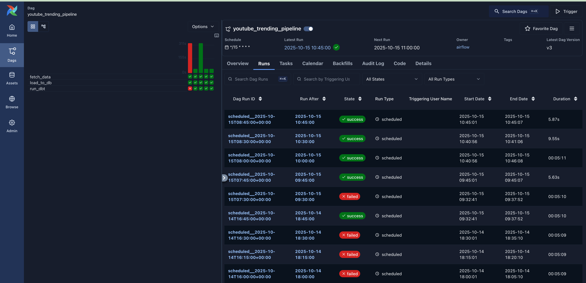
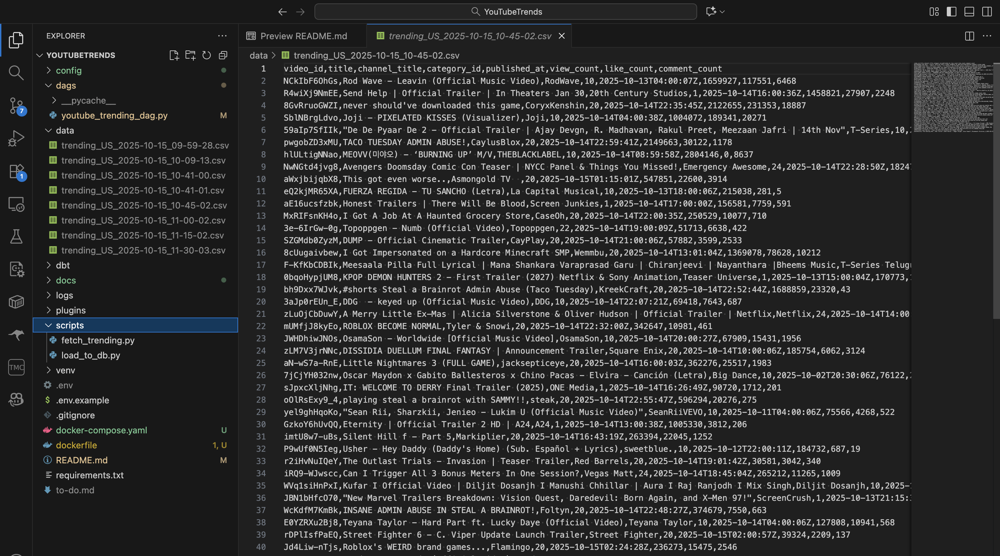

# YouTubeTrends
Automated data pipeline for fetching YouTube trending videos and loading them into a database.

## Overview

A small pipeline that:

- fetches YouTube's trending videos (uses the YouTube Data API v3)
- writes the results as CSV files in `data/`
- loads a CSV into PostgreSQL using SQLAlchemy


There are two main scripts in `scripts/`:

- `fetch_trending.py` — calls the YouTube API and saves a CSV in `data/`.
- `load_to_db.py` — reads a CSV from `data/` and appends it to a Postgres table.

There is also an Airflow DAG at `dags/youtube_trending_dag.py`, which can be used to schedule the fetch with Airflow. At the moment the dag is scheduled for every 15 minutes.

<details>
<summary> ---- How it works in more detail ----</summary>

- `scripts/fetch_trending.py` uses the Google API client `googleapiclient.discovery.build` to call the `videos.list` endpoint with `chart=mostPopular` and `regionCode=US`.
- The script extracts selected fields from the response (video id, title, channel, category id, publication time, and basic stats), converts them to a Pandas DataFrame, and writes a timestamped CSV to `data/`.
- `scripts/load_to_db.py` uses `pandas.read_csv` and `sqlalchemy.create_engine` to append CSV rows to a `trending_videos` table in PostgreSQL.
- `dags/youtube_trending_dag.py` is an Airflow DAG that is used to schedule the fetch and downstream tasks.

</details>

### What is a DAG?
In Airflow, a DAG or Directed Acyclic Graph, is a collection of all the tasks you want to run, organized in a way that reflects their relationships and dependencies.

## How to run project?

1) Clone the repo:

```
git clone https://github.com/em1e/YouTubeTrends.git
```

2) Add your YouTube API key

	- Create a `.env` file in the repo root (example `.env.example` provided):
		`API_KEY=YOUR_YOUTUBE_API_KEY`

	note: fetch_trending.py will attempt to read `API_KEY` and try to load `.env` from the project root.

3) Airflow and Scheduling

I'm using Airflows default Docker Compose file to run the airflow webserver, requirements are included with my `dockerfile` and `requirements.txt`.

- `docker compose up --build` -> build requirements and start all services
- `docker compose down --volumes --rmi all` -> clean up when done

Then you should be able to open the Airflow web server at http://localhost:8080 and enable the `youtube_trending_pipeline` DAG.

db name: `airflow`
user: `airflow`
password: `airflow`

## What did I learn?
I learned a lot during a small window, Airflow, DAGs, dbt, Youtube API. There were a LOT of things that were completely new to me! Gotta say I overall enjoyed the debugging and learning process over these past few days C:



